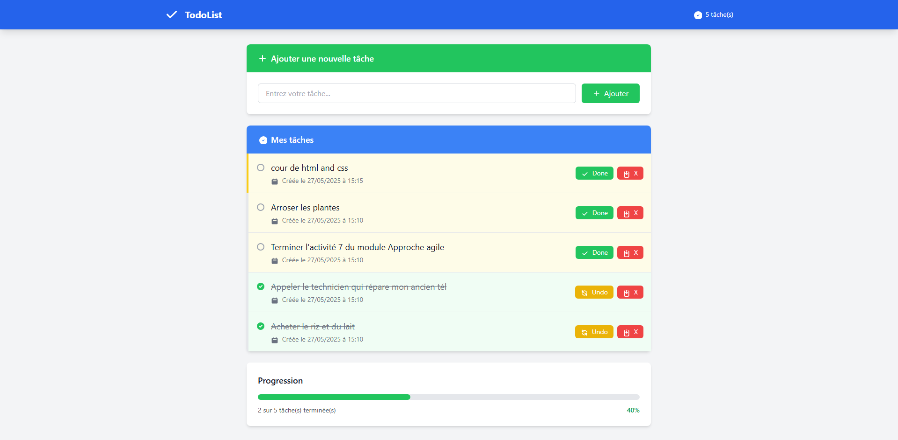

# TodoList - TP Approche Agile

## Description
Application web de gestion de tâches développée dans le cadre du module M202 - Approche Agile.
Version utilisant Tailwind CSS pour le styling.

## Fonctionnalités
- ✅ Ajouter une nouvelle tâche
- ✅ Marquer une tâche comme terminée/non terminée (toggle)
- ✅ Supprimer une tâche
- ✅ Affichage avec couleurs différentes selon le statut
- ✅ Interface responsive avec Tailwind CSS
- ✅ Barre de progression
- ✅ Animations et transitions fluides

## Technologies utilisées
- **Backend** : PHP 7.4+, MySQL 5.7+
- **Frontend** : Tailwind CSS 3.x
- **Icons** : SVG intégrés
- **Animations** : CSS Transitions + JavaScript

## Conformité aux exigences du TP

### Partie Backend ✅
- Constantes de configuration DB en haut du fichier
- Variable `$taches` avec liste triée par date (plus récent au plus ancien)
- Actions `new`, `delete`, `toggle` avec méthode POST
- Requête `UPDATE todo SET done = 1 - done WHERE id = ?` pour toggle
- Champ `id` comme name pour identifier les tâches

### Partie Frontend ✅
- Navbar avec Tailwind CSS
- Formulaire d'ajout avec name='title'
- Équivalent de `list-group-item-success` : `bg-green-50 border-l-4 border-green-400`
- Équivalent de `list-group-item-warning` : `bg-yellow-50 border-l-4 border-yellow-400`
- Input hidden avec ID de la tâche
- Boutons submit avec name="action" et values "toggle"/"delete"

## Classes Tailwind utilisées

### Couleurs par statut
- **Tâches en cours** : `bg-yellow-50 border-l-4 border-yellow-400`
- **Tâches terminées** : `bg-green-50 border-l-4 border-green-400`

### Boutons
- **Ajouter** : `bg-green-500 hover:bg-green-600`
- **Done/Undo** : `bg-green-500/bg-yellow-500 hover:bg-green-600/hover:bg-yellow-600`
- **Supprimer** : `bg-red-500 hover:bg-red-600`

### Layout
- **Container** : `max-w-4xl mx-auto px-4 py-8`
- **Cards** : `bg-white rounded-lg shadow-md`
- **Responsive** : Classes responsive intégrées

## Installation

### 1. Base de données
\`\`\`sql
CREATE DATABASE IF NOT EXISTS todolist;
USE todolist;
CREATE TABLE IF NOT EXISTS `todo` (
  `id` bigint(20) NOT NULL AUTO_INCREMENT,
  `title` varchar(2048) NOT NULL,
  `done` tinyint(1) NOT NULL DEFAULT '0',
  `created_at` timestamp NOT NULL DEFAULT CURRENT_TIMESTAMP,
  PRIMARY KEY (`id`)
);
\`\`\`

### 2. Configuration
Modifiez les paramètres de connexion dans `index.php` :
\`\`\`php
define('DB_USER', 'root');
define('DB_PASS', '');
define('DB_NAME', 'todolist');
define('DB_HOST', '127.0.0.1');
define('DB_PORT', '3306');
\`\`\`

### 3. Déploiement
Placez le fichier `index.php` sur votre serveur web avec PHP et MySQL.

## Commandes Git pour le TP

### Travail en branches
\`\`\`bash
# Créer et basculer sur une nouvelle branche
git checkout -b backend-dev
# ou
git checkout -b frontend-dev

# Ajouter les modifications
git add .
git commit -m "Migration vers Tailwind CSS"

# Synchroniser avec le dépôt distant
git fetch
git diff origin/main
git merge origin/main
git push -u origin nom_branche
\`\`\`

## Avantages de Tailwind CSS
- 🎨 Design system cohérent
- 📱 Responsive design intégré
- ⚡ Performance optimisée
- 🔧 Customisation facile
- 📦 Pas de CSS externe à maintenir

## Auteurs
- Développeur Backend : [Nom du stagiaire 1]
- Développeur Frontend : [Nom du stagiaire 2]
- Formatrice : Asmae YOUALA
